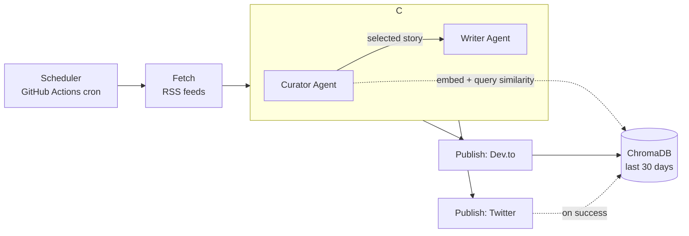

# AI News Agent — Curator/Writer Multi-Agent Edition

A zero-cost AI news automation agent: it fetches recent AI news from RSS,
uses a 2-agent **LangGraph** pipeline (Curator + Writer) backed by a
**ChromaDB** memory of the last 30 days of posts to pick a genuinely novel
story and draft it, then publishes to **Dev.to** (blog) and **Twitter (X)**
(social).

This is the multi-agent evolution of a simpler single-Gemini-call version —
the architectural upgrade is the **Curator agent**, which embeds each
candidate headline and checks it against recent post history before a
single Gemini call makes the final newsworthiness judgment. That's what
stops the agent from blogging the same story three days in a row.

## Architecture



**Curator agent logic** (`src/agents/curator.py`):
1. Embed every candidate article (Gemini embeddings, free tier).
2. For each, query ChromaDB for the nearest post from the last
   `MEMORY_WINDOW_DAYS` → a **novelty score** (0 = basically already
   covered, 1 = nothing similar posted recently). Zero extra LLM calls.
3. Take the top `CURATOR_TOP_K` most novel candidates and make **one**
   Gemini call asking it to pick the most newsworthy of those, with a
   one-sentence reason. This keeps Gemini usage to a single curation
   call per run regardless of how many headlines were fetched.

**Writer agent logic** (`src/agents/writer.py`): drafts the blog post +
Twitter post for the chosen story, given the Curator's reasoning and
the titles of any related-but-not-too-similar recent posts (so it can
explicitly take a different angle instead of accidentally repeating one).

## Project structure

```
ai-news-agent/
├── README.md
├── .env.example
├── .gitignore
├── requirements.txt
├── main.py                          # orchestrator: fetch -> graph -> publish -> remember
├── src/
│   ├── config.py                    # pydantic-settings: validated env config
│   ├── models.py                    # Article, CuratedSelection, GeneratedPost
│   ├── fetchers/
│   │   └── news_fetcher.py          # RSS fetch + dedupe + recency filter
│   ├── memory/
│   │   ├── embeddings.py            # Gemini embeddings wrapper
│   │   └── vector_store.py          # ChromaDB PostMemory (add/query/prune)
│   ├── agents/
│   │   ├── state.py                 # shared LangGraph state schema
│   │   ├── curator.py               # CuratorAgent
│   │   ├── writer.py                # WriterAgent
│   │   └── graph.py                 # build_graph(): wires curator -> writer
│   ├── publishers/
│   │   ├── devto.py
│   │   └── twitter.py
│   └── utils/
│       └── logging_config.py
├── scripts/
│   └── get_linkedin_token.py        # run ONCE locally for the OAuth refresh token
├── tests/                           # pytest, fully offline (no real API calls)
│   ├── conftest.py                  # FakeEmbedder fixture
│   ├── test_news_fetcher.py
│   ├── test_vector_store.py
│   └── test_graph.py
└── .github/workflows/daily_run.yml  # free scheduled run + memory persistence
```

## Setup

```bash
git clone <your-repo> && cd ai-news-agent
python -m venv venv && source venv/bin/activate   # Windows: venv\Scripts\activate
pip install -r requirements.txt
cp .env.example .env   # fill in real values
```

1. **Gemini API key:** [Google AI Studio](https://aistudio.google.com) → free, no credit card.
2. **Dev.to API key:** Dev.to → Settings → Extensions → generate a key. Free, instant.
3. **Twitter app:** [Twitter Developer Portal](https://developer.twitter.com) → create an app
   → get API Key, API Secret, Access Token, and Access Token Secret.
   Make sure it has "Read and write" permissions to create tweets.
   Paste them into your `.env` file under the `TWITTER_*` variables.

## Run it

```bash
# Dry run first — generates content but doesn't publish anything
DRY_RUN=true python main.py

# For real
python main.py
```

## Test it

```bash
pytest -v
```

All tests run fully offline — `tests/conftest.py` provides a deterministic
`FakeEmbedder` so no real Gemini calls happen, and the Curator/Writer agents
are tested as stubs in `test_graph.py` to verify routing logic independent
of actual model output.

## Scheduling for $0

`.github/workflows/daily_run.yml` runs this daily via GitHub Actions
(free minutes), then **commits `data/chroma_db` back to the repo**. This
"git as a free database" pattern is what gives the Curator persistent
memory across runs without a hosted vector DB subscription — store your
secrets under repo Settings → Secrets and variables → Actions.

If you'd rather self-host (e.g. alongside the n8n version of this project),
the ChromaDB directory just persists on disk normally between runs — no
special handling needed.

## Cost breakdown

| Component | Cost |
|---|---|
| RSS feeds | $0 |
| Gemini chat + embeddings (free tier) | $0 — 1 embedding/candidate + 2 chat calls/day, far under the daily cap |
| ChromaDB | $0 (open source, runs locally) |
| Dev.to publishing | $0 |
| Twitter posting | $0 (Free Tier) |
| GitHub Actions scheduling | $0 (well within free minutes/month) |
| **Total** | **$0/month** |

## Known trade-offs / next steps

- The novelty score is a simple cosine-distance heuristic, not a semantic
  "is this the same story" classifier — good enough to avoid obvious
  repeats, not a guarantee against subtler overlap.
- Twitter access tokens do not expire by default for OAuth 1.0a User Context.
- Gemini's free-tier limits have changed multiple times in the last year —
  re-check [Google AI Studio](https://aistudio.google.com)'s quota dashboard
  periodically rather than trusting the model/limits hardcoded here.
