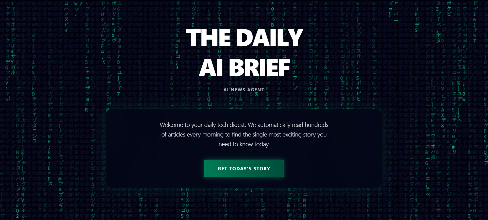
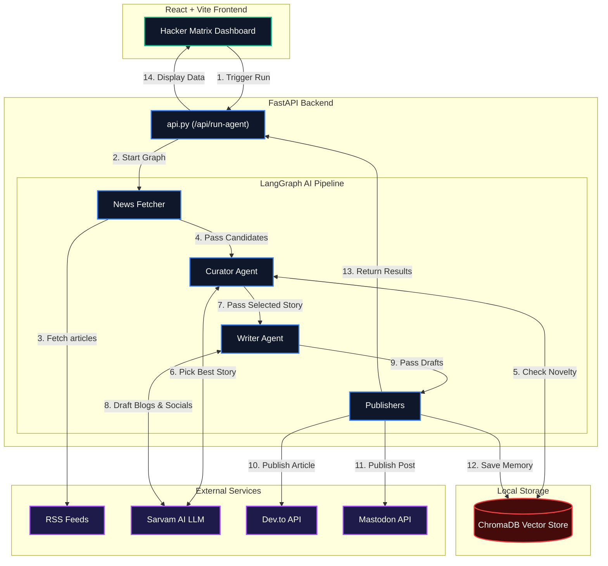

# Tech-Taco AI News Agent 🌮🤖

An autonomous, full-stack AI agent that acts as your personal tech journalist. Powered by **Sarvam AI**, **FastAPI**, and **React**, it automatically fetches hundreds of news articles, curates the most exciting story of the day using a multi-agent LangGraph pipeline, and publishes beautifully formatted blog posts to Mastodon and Dev.to.

## 📸 Frontend Preview

<p align="center">
  
</p>

## 🏗 Architecture

Here is the high-level architecture diagram showing the data flow from the React frontend, through the AI agents, to the external publishers and memory store:



The project is split into a Python FastAPI backend and a React (Vite + Tailwind) frontend.

### 1. The Backend (Python + FastAPI)
Uses a **LangGraph** multi-agent pipeline:
- **Curator Agent:** Fetches RSS feeds, checks recent memory in **ChromaDB** to ensure the story hasn't been posted recently, and uses Sarvam AI to pick the most novel and newsworthy story of the day.
- **Writer Agent:** Takes the chosen story and drafts a highly compelling, human-sounding Markdown article for Dev.to, plus a short thread for Mastodon.
- **FastAPI Server (`api.py`):** Exposes an endpoint (`/api/run-agent`) for the frontend to trigger the pipeline on-demand.

### 2. The Frontend (React + Vite + Tailwind)
A cinematic, premium dark-mode dashboard featuring:
- A pure HTML/CSS/JS **Hacker Matrix** falling-code background.
- Glassmorphism UI components.
- A "Memory Match" mini-game loading screen while the AI agent runs in the background.
- Pixel-perfect social media mockups to preview the Dev.to and Mastodon posts before they go live.

## 🚀 Step-by-Step Setup Guide

Follow these instructions to clone the project and run it on your local machine.

### Prerequisites
- Python 3.10+
- Node.js (v18+)
- Git

### 1. Clone the Repository
```bash
git clone https://github.com/Soujuhegde/Tech-Taco.git
cd Tech-Taco
```

### 2. Backend Setup
Create a virtual environment, activate it, and install the Python dependencies.
```bash
python -m venv .venv

# On Windows:
.venv\Scripts\activate
# On Mac/Linux:
source .venv/bin/activate

pip install -r requirements.txt
```

### 3. Environment Variables
Create a `.env` file in the root directory (same folder as `api.py`) and add your API keys:
```env
# AI Provider
SARVAM_API_KEY="your_sarvam_api_key_here"

# Dev.to Publisher
DEVTO_API_KEY="your_devto_api_key_here"

# Mastodon Publisher
MASTODON_ACCESS_TOKEN="your_mastodon_access_token_here"
MASTODON_API_BASE_URL="https://mastodon.social"
```
*(Note: You can get a free Sarvam API key from their developer portal, a Dev.to key from your account settings, and a Mastodon token by creating a developer app on your Mastodon server).*

### 4. Start the Backend Server
Run the FastAPI backend on port 8000:
```bash
python -m uvicorn api:app --reload
```

### 5. Start the Frontend
Open a **new terminal window** (leave the backend running), navigate to the frontend folder, install the packages, and start the Vite dev server:
```bash
cd frontend
npm install
npm run dev
```

### 6. Run the Agent
Open your browser to `http://localhost:5173`. Click **"Get Today's Story"** and watch the AI agent work its magic!


## 💸 Cost Breakdown
- **RSS Feeds:** $0
- **Sarvam AI API:** Very cheap / Free Tier limits
- **ChromaDB:** $0 (runs locally)
- **Dev.to & Mastodon:** $0
- **React Frontend:** $0 (runs locally)

## 🛠 Tech Stack
- **AI / LLMs:** Sarvam AI, LangGraph, sentence-transformers
- **Database:** ChromaDB (Local Vector Store)
- **Backend:** Python, FastAPI, Uvicorn
- **Frontend:** React, Vite, Tailwind CSS v4
